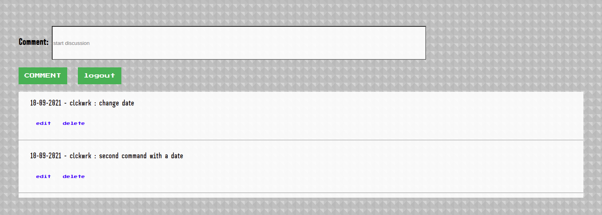
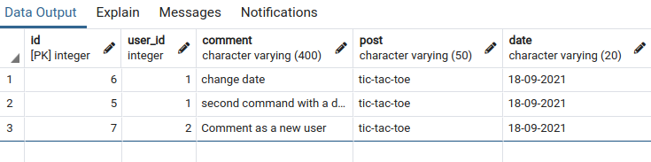
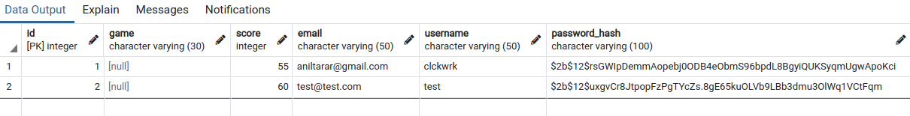

# Personal Blog - Website
## Second GA Project:
<br><br/>

<br><br/>
# Dependencies:

- For full list please check [here](./requirements.txt)
- https://cdnjs.cloudflare.com/ajax/libs/socket.io/1.7.3/socket.io.min.js
<br> <br/>

### Installation of dependencies:

Please intall the adviced versions, there are some backwards compatibility issues with SocketIO.
<br>

```pip install -r requirements.txt```

<br>

# Overlook

After completing this project I will be serving this as my personal website on https://www.neil-tarar.com
For the demonstration purposes I will be serving the site on port 80 without an encryption key on http://www.neil-tarar.com

The site runs on Flask server, some sections are using [Flask-SocketIO](https://flask-socketio.readthedocs.io/en/latest/). I used an apache server to reverse proxy to the flask server and port forwarded it to the internet on http://www.neil-tarar.com. 

I will be sharing my projects on the [blog](http://www.neil-tarar.com/blog) section. I designed the website to reflect my personality and I wrote a mini game to be put on the [main page](http://www.neil-tarar.com/). By this way I am hoping to make the website more engaging. I have been inspired by good old [Astroids](https://en.wikipedia.org/wiki/Asteroids_(video_game)) game which I spent countless hours playing on my Atari!  

 

The game is written drawn on [HTML canvas](https://developer.mozilla.org/en-US/docs/Web/API/Canvas_API) and the logic is written in JavaScript.

If users login with their accounts their scores will be captured automatically when the game ends. 

Code on server end:
```python
@socketio.on('score')
    def receive_score(score):
    user_id = session.get('user_id')
    user_score = get_user_score(user_id)[0][0]
    if score > user_score:
    score_save(score , user_id)
```
Code to send the score from JavaScript
```javascript
socket.emit('score', point);
```
`.emit` method allows you to name the message manually, in my case I named it `score` .

Highest score is visible on the main page to showcase the glory of the score owner. 

<p align="center" width="100%">
    
</p>

<br>

## Blog Comments



When logged in users can edit and delete their own comments.  

<br>

# DATABASE:

Website uses two databases, you can see the structure [here](./database.sql) .

<br>

### Comments Table:

<br>



### Users Table:

<br>



# Future Improvements

Detect if the username is taken. Add more games to the main page and randomly. Improve the over looks and design. Serve it on port 443.  

<br><br/>
# What I Learned
I learnt more front end technologies than back end in this project. Primarily HTML canvas was the biggest learning curve, and I enjoyed it more than I thought that I would. 
