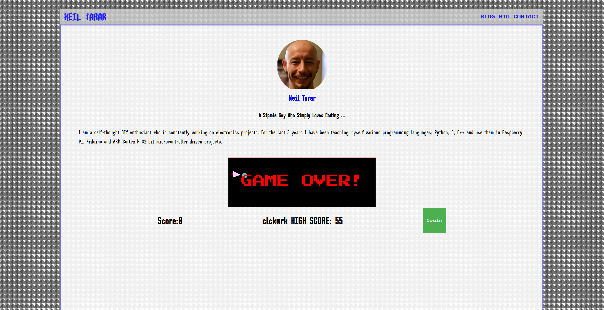
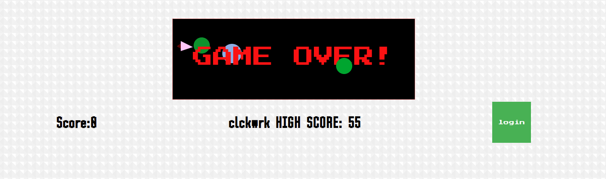

# Personal Blog - Website
## Second GA Project:
  

  
# Dependencies:

- For full list please check [here](./requirements.txt)
- https://cdnjs.cloudflare.com/ajax/libs/socket.io/1.7.3/socket.io.min.js
   

### Installation of dependencies:

Please intall the adviced versions, there are some backwards compatibility issues with SocketIO.
 

`pip install -r requirements.txt`

  
# Overlook

After completing this project I will be serving this as my personal website on https://neil-tarar.com
For the demonstration purposes I will be serving the site on port 80 without an encryption key on http://neil-tarar.com

The site runs on Flask server, some sections are using [Flask-SocketIO](https://flask-socketio.readthedocs.io/en/latest/). I used an apache server to reverse proxy to the flask server and port forwarded it to the internet on http://neil-tarar.com. 

I will be sharing my projects on the [blog](http://neil-tarar.com/blog) section. I designed the website to reflect my personality and I wrote a mini game to be put on the [main page](http://neil-tarar.com). By this way I am hoping to make the website more engaging. I have been inspired by good old [Astroids](https://en.wikipedia.org/wiki/Asteroids_(video_game)) game which I spent countless hours playing on my Atari!  

 

If users login with their accounts their scores will be captured automatically when the game ends. The Highest score is visible on the main page to showcase the glory of the score owner. 

    

 

## Blog Comments

# Future Improvements

Detect if the username is taken. Add more games to the main page. 

  
# What I Learned
I spent majority of my time on researching and learning how to use Flask Socketio library as well as Apache Server settings. I learned how to create individual rooms to broadcast to a targeted audience however I didn't have enough time to implement this before the presentation day.  
